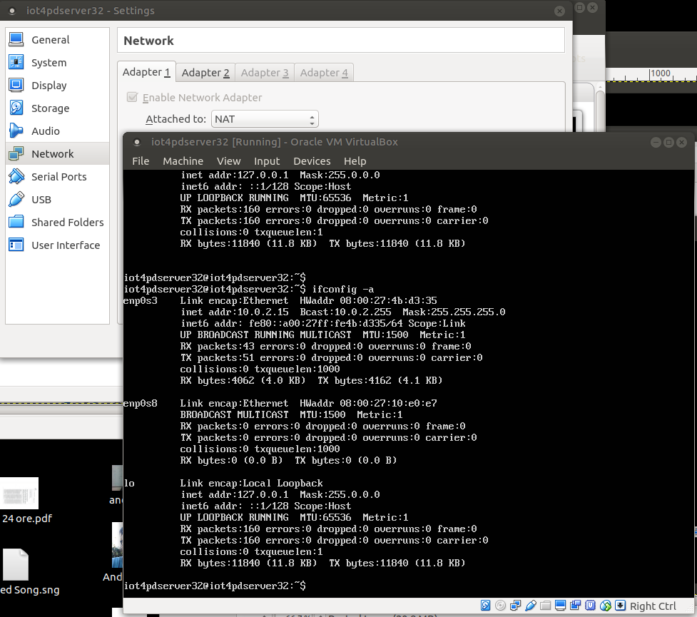
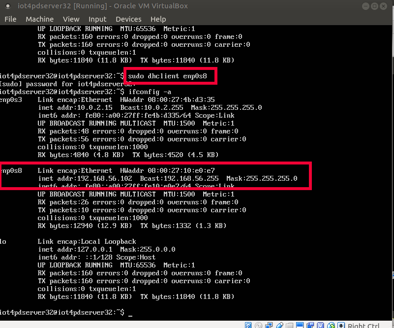
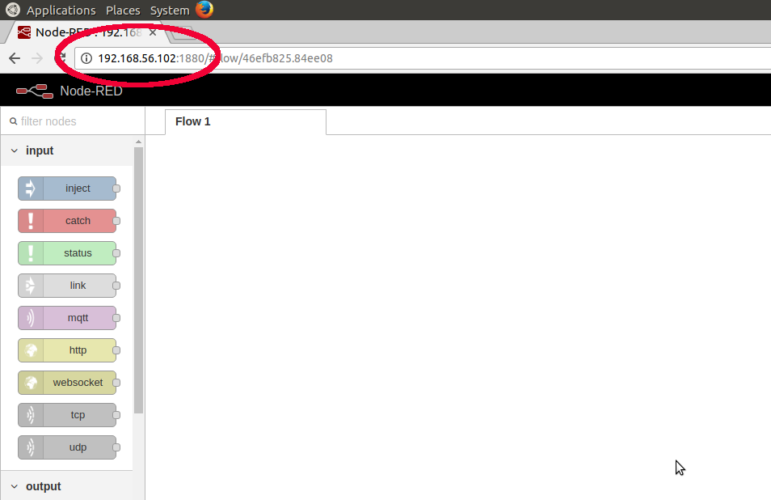

# 32 bit version

0. Download the [virtual hard disk file](https://drive.google.com/file/d/0B7UXCP3XMOCzUV9GSkhsQnRLXzQ/view?usp=sharing) with the server
1. Open Virtual Box
2. New
3. Name = Iot4pdserver32, Type = Linux, Version = Ubuntu (32 bit) and Next
4. 2048 MB, and Next
5. use an existing virtual hard disk file and select the file you have downloaded at step 0 named iot4pdserver32.vdi
6. Add a network interface as in the picture below


Click on the new created machine and go into the terminal console

* access with username iot4pdserver32 and pwd iot4pdserver32
* check the address of the server with ```ifconfig -a```



* Notice that the interface enp0s8 did not start properly ... this is a weired behaviour of 32 bit, but do not worry
* in the console digit ```sudo dhclient enp0s8``` ... the password is as usual iot4pdserver32
* After a while, when the prompt is again available digit ```ifconfig -a```. You should get something similar to the picture below




* start node-red writing node-red on the terminal console 


