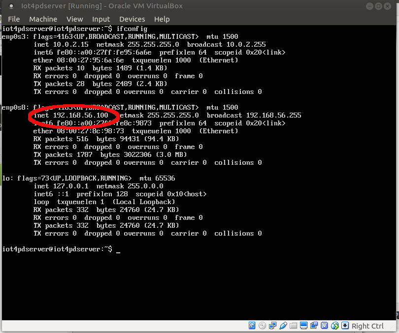
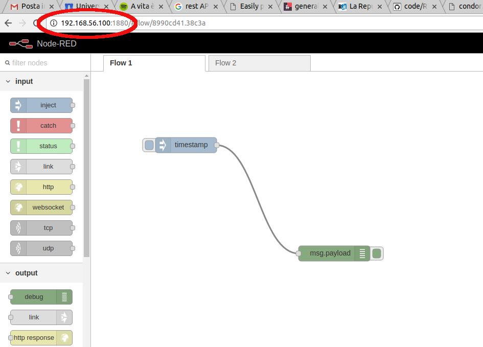

0. Download the [virtual hard disk file](https://drive.google.com/file/d/0B7UXCP3XMOCzRlFrMGEtdjhjbE0/view?usp=sharing) with the server
1. Open Virtual Box
2. New
3. Name = Iot4pdserver, Type = Linux, Version = Ubuntu (64 bit) and Next
4. 2048 MB, and Next
5. use an existing virtual hard disk file and select the file you have downloaded at step 0 named iot4pdserver.vdi
6. Add a network interface as in the picture below

Click on the new created machine and go into the terminal console

* access with username iot4pdserver and pwd iot4pdserver
* check the address of the server with ifconfig 

* start node-red writing node-red on the terminal console 

