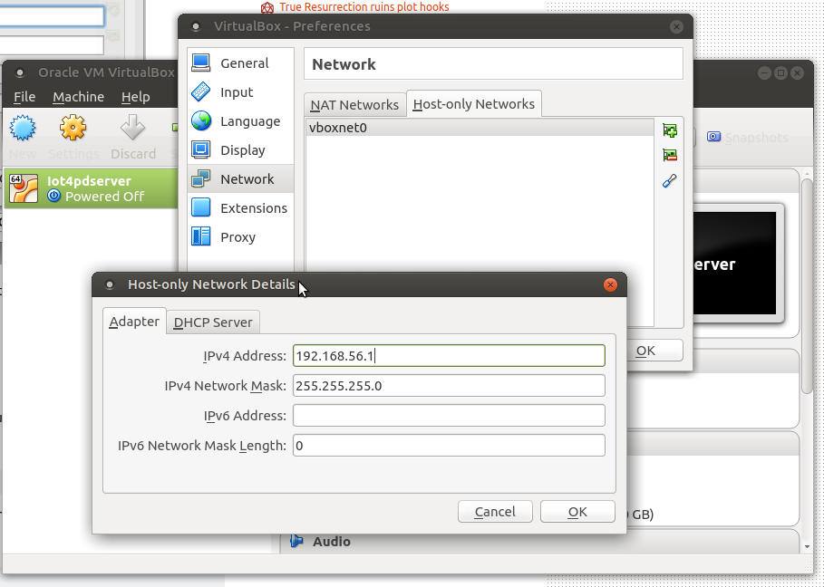
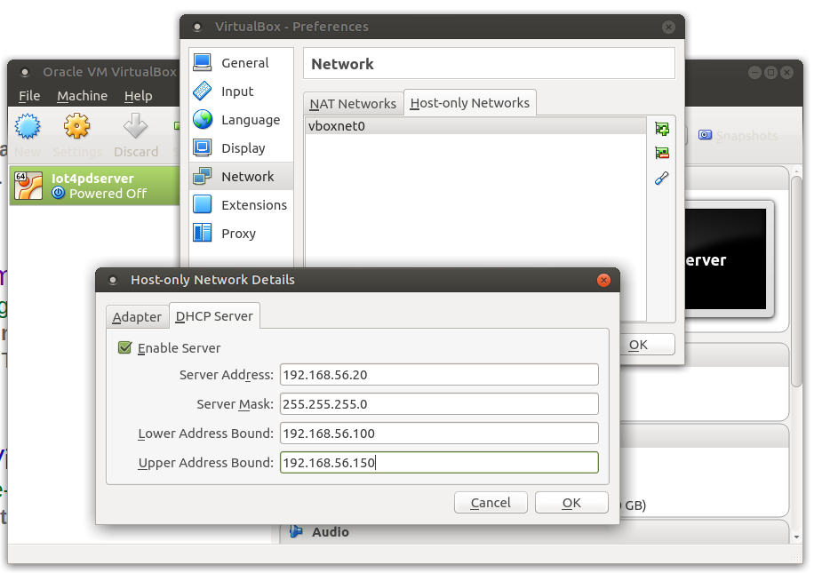

# Code and resources

A [Virtualbox](https://www.virtualbox.org/) machine used for the exercises is available [here](https://drive.google.com/file/d/0B7UXCP3XMOCzRlFrMGEtdjhjbE0/view?usp=sharing) 

Please follow the [instructions](https://www.virtualbox.org/manual/ch02.html) for your distribution to install Virtualbox. 

Once installed:

Go into the File, Preferences tab and select Network:

* Click on the Host-only Network tab
* click the button with the +
* vboxnet0 appears. Configure the network parameters as in the following pictures

Now it is time to install the virtual hard disk image

* [32 bit version](32bit.md)
* [64 bit version](64bit.md)

