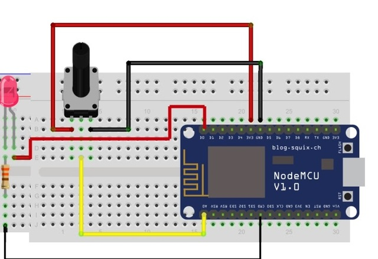
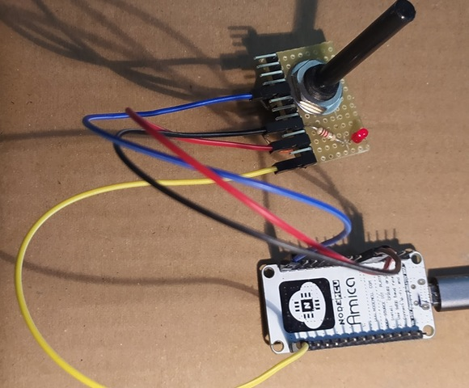

# The Simplest Smart Object

One sensor, namely the potentiometer and one actuator, namely the led.

**Material**: 

1) A breadboard [it is availbale in multiple places e.g.](https://www.amazon.it/Neuftech%C2%AE-Basetta-Sperimentale-Breadboard-Raspberry/dp/B00PIMRREC/ref=sr_1_2_sspa?__mk_it_IT=%C3%85M%C3%85%C5%BD%C3%95%C3%91&crid=1D7PIBT46V477&keywords=breadboard&qid=1669626214&qu=eyJxc2MiOiI1LjY0IiwicXNhIjoiNS40OSIsInFzcCI6IjUuMTkifQ%3D%3D&s=industrial&sprefix=breadboard%2Cindustrial%2C97&sr=1-2-spons&sp_csd=d2lkZ2V0TmFtZT1zcF9hdGY&psc=1)
2) A potentiometer (e.g., 100Kohm )
3) A led
4) A 200 ohm resistor
5) Some wires [Availbale in multiple places e.g.](https://www.amazon.it/Collegamento-Breadboard-Lunghezza-Ponticelli-Compatibile/dp/B09TZLSD26/ref=asc_df_B09TZLSD26/?tag=googshopit-21&linkCode=df0&hvadid=603000396873&hvpos=&hvnetw=g&hvrand=1476180241449497462&hvpone=&hvptwo=&hvqmt=&hvdev=c&hvdvcmdl=&hvlocint=&hvlocphy=1008736&hvtargid=pla-1665572079522&psc=1) 
