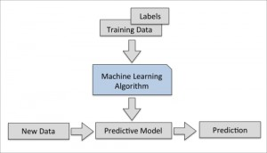
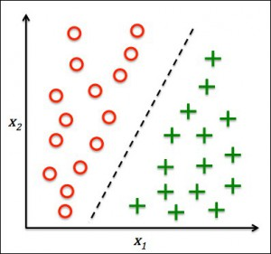
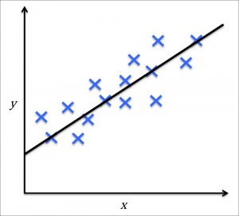

#Preliminaries

[Iot for Product Designer Blog](http://iot4pd.blogspot.it/) 

## [What is the IoT](https://youtu.be/wL34vK-On3o)

[](https://www.youtube.com/watch?v=wL34vK-On3o)

## [How it works](https://youtu.be/uEsKZGOxNKw)

[](https://www.youtube.com/watch?v=uEsKZGOxNKw)


## [A nice example](https://youtu.be/QSIPNhOiMoE)

[](https://www.youtube.com/watch?v=QSIPNhOiMoE)


## [Iot Landscape 2016](http://mattturck.com/2016/03/28/2016-iot-landscape/) 

 


#Introduction

## Smart Object

A smart object is an object capable to sense data from the environment, elaborate and take decision on the acquired data, and finally to act into th environment by suitable actuator.


In this example the smart thermostat [NEST](https://nest.com/). A very basic intelligence into the thermostat could be 

> Switch on the heater when the temperature is below 15 degree

Notice that you already know how to implement such basic intelligene on [Arduino](https://www.arduino.cc/).

### Sense
```c
const int analogInPin = A0;  // Analog input pin that the potentiometer is attached to
	
int sensorValue = 0;        // value read from the pot
	
void setup() {
	  // initialize serial communications at 9600 bps:
	  Serial.begin(9600);
	}
	
void loop() {
	  // read the analog in value: ... SENSE
	  sensorValue = analogRead(analogInPin);
	
	  // print the results to the serial monitor:
	  Serial.print("sensor = ");
	  Serial.print(sensorValue);
	
	  // wait 2 milliseconds before the next loop
	  // for the analog-to-digital converter to settle
	  // after the last reading:
	  delay(2);
	}
	
```

	


### Think
> Switch on the heater when the temperature is below 15 degree

```c

const int analogInPin = A0;  // Analog input pin that the potentiometer is attached to
	
int sensorValue = 0;        // value read from the pot
	
void setup() {
	  // initialize serial communications at 9600 bps:
	  Serial.begin(9600);
	}
	
void loop() {
	  // read the analog in value: ... SENSE
	  sensorValue = analogRead(analogInPin);
	  
	  if (sensorValue <15) // THINK
	  {
	       ....
	  }
	
	  delay(2);
	}
```
### Act

```c
const int analogInPin = A0;  // Analog input pin that the potentiometer is attached to
const int analogOutPin = 9; // Analog output pin that the LED is attached to
	
int sensorValue = 0;        // value read from the pot
int outputValue = 0;        // value output to the PWM (analog out)
	
void setup() {
	  // initialize serial communications at 9600 bps:
	  Serial.begin(9600);
	}
	
void loop() {
	  // read the analog in value: ... SENSE
	  sensorValue = analogRead(analogInPin);
	   if (sensorValue > 15) // THINK
	  {
	    // map it to the range of the analog out:
	    outputValue = map(sensorValue, 0, 1023, 0, 255);
	    // change the analog out value: ... ACT
	    analogWrite(analogOutPin, outputValue);
	  }
	  delay(2);
	}
```	


## Even Smarter

The slogan at [NEST](https://nest.com/) website says

>Meet the 3rd gen Nest Learning Thermostat


The ability of learning allow us to implement a smarter object capable to answer to questions like

>Switch on the heater when I feel cold.

## IoT: Connected Smart Objects

>Switch on the heater when I feel cold and pollution in Rome is less than ...


## Measuring is necessary to understand 

"When you can measure what you are speaking about and express it in numbers, you know something about it."Lord Kelvin, speaking to the Institution of Civil Engineers, May 3, 1883

 


## A short digression on learning

 

 

 


